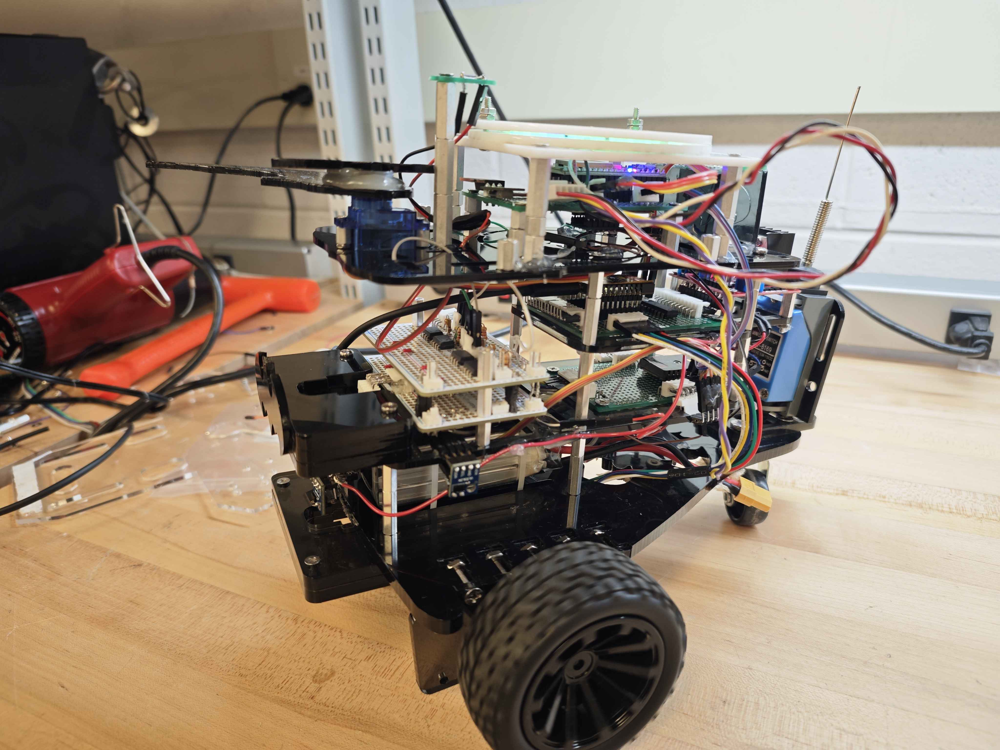
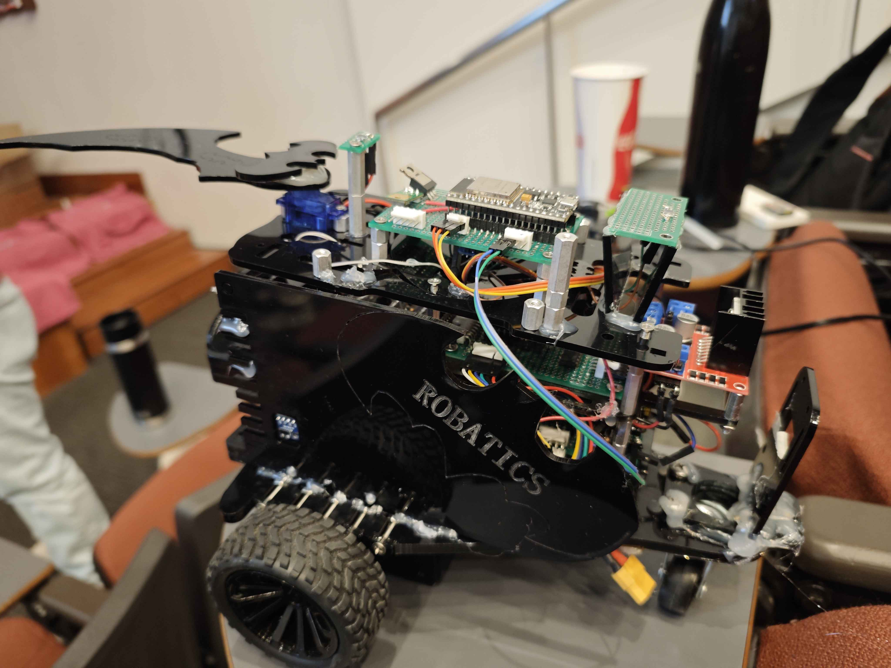
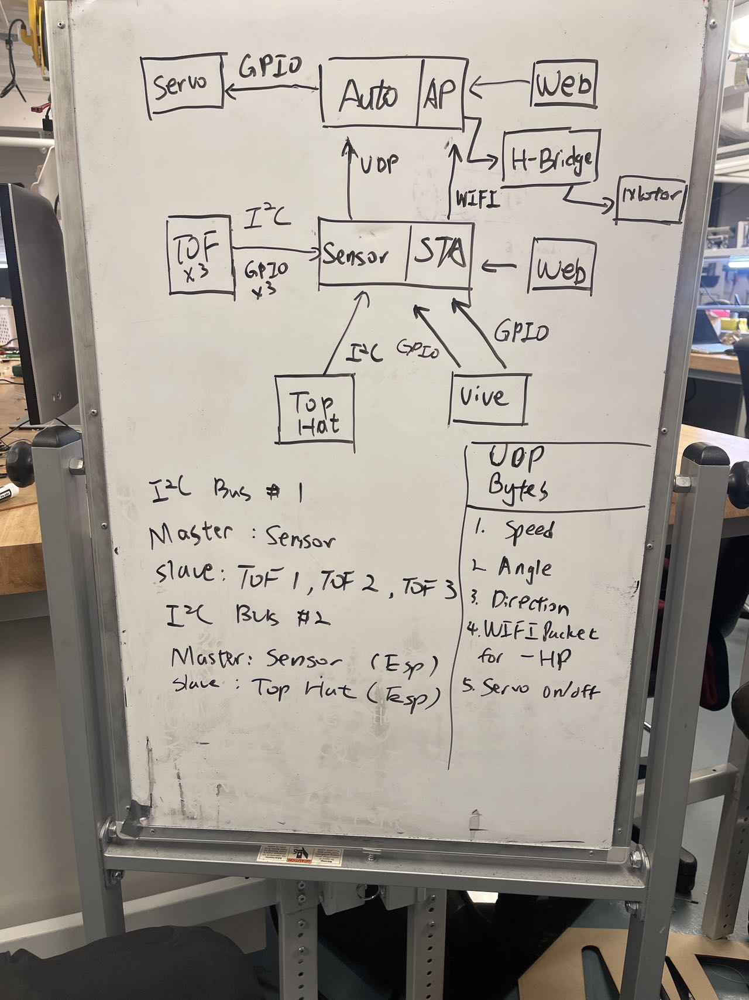

# Semi Autonomous Differential Drive 

## Overview

A mechatronic system enabling autonomous navigation, wall-following, and manual control via a web interface.

[Competition Video](media/robot_competition.mp4)

## Features

- **PID Control** for precise movement via encoders.
- **Wall Following** using ToF sensors.
- **Vive Tracker Integration** for position and orientation.
- **RGB LED Effects** for system feedback.
- **Web-Based Control** for easy operation.

## System Structure

## Contributors

**MEAM 5100 Fall 2024 Team 27**

Members:

- Vaibhav Thakkar
- Yi Cao
- Kartik Virmani
- Xinyi Zhao
